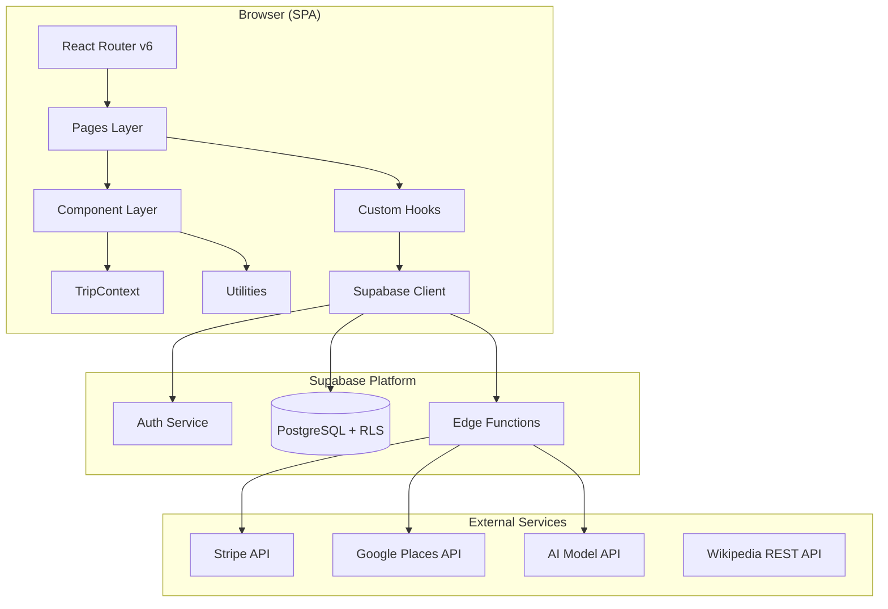
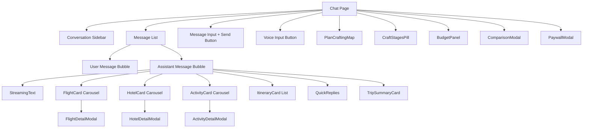

# Design Document — Full Site Rebuild

## Overview

This design describes the complete rebuild of the Jolliday AI Travel Planner as a single-page application. The rebuild preserves the existing UI/UX and feature set while producing a clean, well-structured codebase from scratch.

The application is a conversational AI travel planner that:
1. Accepts natural-language trip requests via a streaming chat interface
2. Generates structured trip plans (flights, hotels, activities, itineraries) via Supabase Edge Functions
3. Verifies and enriches plans with real Google Places data (QA enrichment pipeline)
4. Displays plans as interactive cards, maps, timelines, and a magazine-style Trip Detail Page
5. Supports saving, sharing, exporting, and comparing trip items
6. Manages subscriptions via Stripe with a paywall for premium features

**Tech Stack:**
- React 18 + TypeScript + Vite (SWC plugin)
- Tailwind CSS 3 + shadcn/ui (Radix primitives)
- React Router DOM v6
- TanStack React Query
- React Context (TripContext)
- Supabase (Auth, PostgreSQL, Edge Functions)
- Stripe (subscriptions via Edge Functions)
- Leaflet / React-Leaflet (maps)
- jsPDF (PDF export)
- Embla Carousel (card carousels)
- Zod (runtime validation)
- Vitest + React Testing Library (testing)

## Architecture

### High-Level Architecture



### Project Structure

```
src/
├── main.tsx                    # Entry point, renders App
├── App.tsx                     # Root: providers + router
├── index.css                   # Tailwind directives + custom keyframes
├── vite-env.d.ts               # Vite env type declarations
│
├── components/
│   ├── ui/                     # shadcn/ui primitives (button, dialog, toast, etc.)
│   ├── landing/                # Landing page section components
│   │   ├── HeroSearch.tsx
│   │   ├── HowItWorks.tsx
│   │   ├── DestinationsMosaic.tsx
│   │   ├── SocialProof.tsx
│   │   ├── HomeFAQ.tsx
│   │   ├── WhyJolliday.tsx
│   │   ├── ValueRows.tsx
│   │   ├── ProductPreview.tsx
│   │   ├── FinalCTA.tsx
│   │   └── MobileStickyCTA.tsx
│   ├── FlightCard.tsx          # Flight display card + detail modal trigger
│   ├── HotelCard.tsx           # Hotel display card
│   ├── ActivityCard.tsx        # Activity display card
│   ├── ItineraryCard.tsx       # Day-by-day itinerary card
│   ├── FlightDetailModal.tsx   # Full flight details modal
│   ├── HotelDetailModal.tsx    # Full hotel details modal
│   ├── ActivityDetailModal.tsx # Full activity details modal
│   ├── TripSummaryCard.tsx     # Cinematic plan-ready card in chat
│   ├── TripMap.tsx             # Leaflet map with markers
│   ├── TripTimeline.tsx        # Day-by-day timeline view
│   ├── PlanCraftingMap.tsx     # SVG plane animation during generation
│   ├── CraftStagesPill.tsx     # Progress stages pill
│   ├── StreamingText.tsx       # rAF-batched token rendering
│   ├── QuickReplies.tsx        # Quick reply buttons
│   ├── BudgetPanel.tsx         # Trip basket budget summary
│   ├── ComparisonModal.tsx     # Side-by-side comparison
│   ├── PaywallModal.tsx        # Subscription paywall
│   ├── CancelSubscriptionModal.tsx
│   ├── PricingSection.tsx      # Plan pricing display
│   ├── PhotoLightbox.tsx       # Full-screen image viewer
│   ├── PlacesGallery.tsx       # Destination photo gallery
│   ├── PackingList.tsx         # Checkable packing list
│   ├── CurrencyConverter.tsx   # Currency conversion widget
│   ├── WeatherCard.tsx         # Weather info display
│   ├── TravelInfoCard.tsx      # Visa/language/timezone info
│   ├── VoiceInput.tsx          # Web Speech API voice input
│   ├── PlanPreviewGate.tsx     # Paywall gate for plan preview
│   ├── HeroSection.tsx         # Reusable hero section
│   ├── Logo.tsx                # Logo mark + wordmark
│   └── TrustLine.tsx           # Trust indicator
│
├── contexts/
│   └── TripContext.tsx         # Basket + compare state management
│
├── hooks/
│   ├── useAuth.ts              # Auth state (user, loading, signOut)
│   ├── useRzumaChat.ts         # Chat + SSE streaming + QA enrichment
│   ├── useSubscription.ts      # Subscription check (edge fn + DB fallback)
│   ├── useIsAdmin.ts           # Admin role check
│   ├── useCityHeroImage.ts     # Hero image resolution (stock → Wikipedia → fallback)
│   ├── useCityImages.ts        # Destination images via enrich-destination
│   ├── use-mobile.tsx          # Viewport breakpoint detection
│   └── use-toast.ts            # Toast hook (Radix)
│
├── integrations/
│   └── supabase/
│       ├── client.ts           # Typed Supabase client initialization
│       └── types.ts            # Auto-generated Database types
│
├── lib/
│   ├── authFetch.ts            # getAuthHeader() utility
│   ├── stripeCheckout.ts       # Stripe checkout redirect logic
│   └── utils.ts                # cn() class merge utility
│
├── pages/
│   ├── Index.tsx               # Landing page
│   ├── Chat.tsx                # AI chat interface
│   ├── Auth.tsx                # Sign in / sign up
│   ├── MyTrips.tsx             # Saved trips dashboard
│   ├── TripDetail.tsx          # Magazine-style trip view
│   ├── SharedTrip.tsx          # Public shared trip view
│   ├── Settings.tsx            # User preferences
│   ├── Admin.tsx               # Admin panel
│   ├── ResetPassword.tsx       # Password reset
│   ├── FAQ.tsx                 # FAQ page
│   ├── Terms.tsx               # Terms of service
│   ├── Privacy.tsx             # Privacy policy
│   ├── Contact.tsx             # Contact form
│   ├── Unsubscribe.tsx         # Email unsubscribe
│   ├── Promo.tsx               # Landscape promo
│   ├── Promox.tsx              # 9:16 vertical promo
│   ├── Promoar.tsx             # Arabic RTL promo
│   └── NotFound.tsx            # 404 page
│
├── utils/
│   ├── planParser.ts           # Character-by-character fence extraction
│   ├── cityImages.ts           # Curated city → Unsplash URL map
│   ├── bookingLinks.ts         # Skyscanner/Booking.com URL builders
│   ├── currencyLocale.ts       # Currency formatting utilities
│   ├── pdfExport.ts            # jsPDF trip export
│   ├── photoGallery.ts         # Photo gallery helpers
│   ├── shareCardImage.ts       # 9:16 share card generation
│   ├── tripI18n.ts             # i18n translations (10 languages)
│   └── tripSummary.ts          # Trip summary data extraction
│
└── test/
    ├── setup.ts                # Vitest setup (jsdom, RTL matchers)
    └── example.test.ts         # Baseline test
```

### Context Hierarchy

The application wraps all routes in a strict nesting order:

```
ThemeProvider (next-themes, forced light)
  └── QueryClientProvider (TanStack React Query)
       └── TripProvider (basket + compare state)
            └── TooltipProvider (Radix)
                 ├── Toaster (Radix Toast)
                 ├── Sonner (Sonner toast)
                 └── BrowserRouter
                      └── Routes (all pages)
```

### Routing Strategy

All routes except the landing page use `React.lazy` + `Suspense` for code splitting:

```typescript
const Chat = lazy(() => import("./pages/Chat"));
const Auth = lazy(() => import("./pages/Auth"));
// ... etc
```

The landing page (`Index`) is eagerly loaded for optimal LCP.

## Components and Interfaces

### Core Hook Interfaces

#### useRzumaChat

The central chat hook managing conversations, SSE streaming, QA enrichment, and activity swaps.

```typescript
interface Message {
  role: "user" | "assistant";
  content: string;
}

interface Conversation {
  id: string;        // crypto.randomUUID()
  title: string;     // First 40 chars of first user message
  messages: Message[];
  updatedAt: number; // Date.now() timestamp
}

interface UserPreferences {
  visitedPlaces: { name: string; rating: string; category: string }[];
  likedCategories: string[];
  dislikedCategories: string[];
  homeCity: string;
  travelStyle: string;
  dietaryRestrictions: string[];
  pastTrips: string[];
  displayName: string;
}

type QaStatus = null | "verifying";

// Return type
interface UseRzumaChatReturn {
  messages: Message[];
  isLoading: boolean;
  qaStatus: QaStatus;
  error: string | null;
  sendMessage: (input: string) => Promise<void>;
  clearChat: () => void;
  conversations: Conversation[];
  activeId: string | null;
  newChat: () => void;
  switchChat: (id: string) => void;
  deleteChat: (id: string) => void;
  openSavedTrip: (title: string, messages: Message[]) => void;
  preferences: UserPreferences;
  updatePreferences: (updater: (prev: UserPreferences) => UserPreferences) => void;
  syncPrefsToDb: (prefs: UserPreferences) => Promise<void>;
  exportLocalData: () => { conversations: Conversation[]; preferences: UserPreferences };
  replaceActivity: (messageIndex: number, oldActivityId: string, newActivity: any) => void;
  replaceItinerarySlot: (messageIndex: number, dayNumber: number, slotIndex: number, newActivity: any) => void;
}
```

**SSE Streaming Architecture:**
1. POST conversation history + preferences to `rzuma-chat` Edge Function
2. Read SSE stream via `ReadableStream` reader
3. Parse `data: {json}` lines, extract `choices[0].delta.content`
4. Batch DOM updates via `requestAnimationFrame` — accumulate tokens in `pendingContent`, flush once per frame
5. On stream completion, finalize with `cancelAnimationFrame` + synchronous flush

**QA Enrichment Pipeline:**
1. After stream completes, detect structured plan via regex (`/```(activities|itinerary|hotels|flights)\b/`)
2. POST plan text + destination hint to `review-trip-plan` Edge Function
3. If approved with enriched data, swap assistant message content in-place
4. If failed/unapproved, retain original plan (fail-open)

#### useAuth

```typescript
interface UseAuthReturn {
  user: User | null;       // Supabase User object
  loading: boolean;
  signOut: () => Promise<void>;
}
```

Listens to `onAuthStateChange` events. On first sign-in of a new user (created within last 60s), triggers welcome email via `send-transactional-email` Edge Function.

#### useSubscription

```typescript
type SubscriptionPlan = "free" | "monthly" | "annual";

interface UseSubscriptionReturn {
  plan: SubscriptionPlan;
  isPremium: boolean;
  loading: boolean;
  subscriptionId: string | null;
  subscriptionEnd: string | null;
  cancelAtPeriodEnd: boolean;
  refreshSubscription: () => Promise<void>;
}
```

**Fallback chain:**
1. Invoke `check-subscription` Edge Function
2. On failure → query `subscriptions` table (active + not expired)
3. On failure → default to "free"

Polls every 60 seconds via `setInterval`.

#### getAuthHeader

```typescript
async function getAuthHeader(): Promise<string>
```

Returns `Bearer {jwt}` if authenticated, falls back to `Bearer {anon_key}`. Never throws.

### Plan Parser Interface

```typescript
type PlanBlockRange = { raw: string; range: [number, number] };

// Extract raw fenced blocks with character ranges
function extractFencedBlocks(text: string, type: string): PlanBlockRange[];

// Extract + parse JSON, returning items array and ranges
function extractBlock(text: string, type: string): { items: any[]; ranges: [number, number][] };

// Strip all known block types from text, returning prose
function stripFencedBlocks(text: string, ranges: [number, number][]): string;
```

**Supported block types:** `flights`, `activities`, `hotels`, `itinerary`, `timeline`, `destination_enrich`, `travelinfo`, `weather`, `quickreplies`, `places`

**Key algorithm details:**
- Character-by-character scan tracking JSON string context (`inString`, `escape` flags)
- Fence opening requires preceding newline (or start of text)
- Same-line JSON support: if content after fence name starts with `[` or `{`, treat as block body
- Streaming tolerance: strips trailing commas, auto-closes unbalanced braces/brackets
- Invalid JSON returns empty items array (no throw)

### TripContext Interface

```typescript
type TripItem =
  | { type: "flight"; data: FlightData }
  | { type: "activity"; data: ActivityData }
  | { type: "hotel"; data: HotelData };

type CompareItem =
  | { type: "flight"; data: FlightData }
  | { type: "hotel"; data: HotelData };

interface TripContextType {
  items: TripItem[];
  addItem: (item: TripItem) => void;
  removeItem: (type: string, id: string) => void;
  isInTrip: (type: string, id: string) => boolean;
  clearTrip: () => void;
  totalBudget: number;
  currency: string;
  compareItems: CompareItem[];
  addToCompare: (item: CompareItem) => void;
  removeFromCompare: (type: string, id: string) => void;
  isInCompare: (type: string, id: string) => boolean;
  clearCompare: () => void;
}
```

**Budget calculation:** `sum(flight.price) + sum(activity.price) + sum(hotel.pricePerNight × 3)`

**Deduplication:** `addToCompare` checks existing items by type + id before adding.

### Trip Summary Card → Trip Detail Page Handoff

Data flows from chat to Trip Detail Page via `sessionStorage`:

```typescript
// Written by TripSummaryCard on click
sessionStorage.setItem("jolliday-trip-detail", JSON.stringify({
  data: TripPlanData,           // flights, hotels, activities, itinerary, timeline, travelInfo, quickReplies, text
  destination: string,
  enrichedImages?: any[],       // Sliced to 5 max
  itineraryVenuePhotos?: Record<string, VenuePhotoSlim>
}));

// Fallback: if sessionStorage quota exceeded, retry without photos
sessionStorage.setItem("jolliday-trip-detail", JSON.stringify({
  data: TripPlanData,
  destination: string
}));
```

### Edge Function Contracts

| Function | Method | Auth | Request Body | Response |
|----------|--------|------|-------------|----------|
| `rzuma-chat` | POST | Bearer JWT/anon | `{ messages: Message[], preferences?: UserPreferences }` | SSE stream: `data: {"choices":[{"delta":{"content":"..."}}]}` |
| `review-trip-plan` | POST | Bearer JWT/anon | `{ planText: string, destinationHint: string }` | `{ approved: boolean, enrichedPlan?: string, issues?: string[] }` |
| `enrich-destination` | POST | Bearer JWT/anon | `{ destination: string }` | `{ photos: {url, thumbUrl}[], coordinates: {lat, lng}, description: string }` |
| `create-checkout` | POST | Bearer JWT | `{ plan: "monthly" \| "annual" }` | `{ url: string }` |
| `check-subscription` | POST | Bearer JWT | (none) | `{ subscribed: boolean, plan?: string, subscription_id?: string, subscription_end?: string, cancel_at_period_end?: boolean }` |
| `customer-portal` | POST | Bearer JWT | (none) | `{ url: string }` |
| `send-transactional-email` | POST | Bearer JWT/service | `{ templateName: string, recipientEmail: string, idempotencyKey: string, templateData: object }` | `{ success: boolean }` |

### Component Hierarchy (Chat Page)



### Animation System

Animations are defined as Tailwind keyframes in `tailwind.config.ts` and applied via utility classes:

| Animation | Class | Duration | Easing | Usage |
|-----------|-------|----------|--------|-------|
| Fade-in | `animate-fade-in` | 300ms | ease-out | Section viewport entry |
| Ken Burns | `animate-ken-burns` | 18s | ease-in-out, alternate | Hero images |
| Punch-in | `animate-punch-in` | 1.1s | cubic-bezier(0.22,1,0.36,1) | Modal/card entrance |
| Hero rise | `animate-hero-rise` | 600ms | ease-out | Staggered text/tile entry |
| Letter rise | `.letter-rise` | 500ms | cubic-bezier(0.22,1,0.36,1) | Destination name chars |
| Share breathe | `animate-share-breathe` | 3s | ease-in-out, infinite | Card shadow pulse |
| Streaming word | `.word-fade-up` | 320ms, 18ms stagger | ease-out | Token rendering |
| Plane flight | SVG `offset-distance` | Progress-based | cubic-bezier(0.25,1,0.5,1) | PlanCraftingMap |

CSS custom properties control stagger delays: `style={{ animationDelay: "Xs" }}`.

## Data Models

### Database Schema

```mermaid
erDiagram
    auth_users ||--o| profiles : "trigger creates"
    auth_users ||--o| user_preferences : "has"
    auth_users ||--o{ saved_trips : "owns"
    auth_users ||--o{ shared_trips : "owns"
    auth_users ||--o| subscriptions : "has"
    auth_users ||--o{ user_roles : "has"

    profiles {
        uuid id PK
        uuid user_id UK "NOT NULL, refs auth.users"
        text display_name
        text avatar_url
        timestamptz created_at "NOT NULL, default now()"
    }

    user_preferences {
        uuid id PK
        uuid user_id UK "NOT NULL, refs auth.users"
        text home_city
        text travel_style
        jsonb dietary_restrictions "default '[]'"
        jsonb past_trips "default '[]'"
        jsonb visited_places "default '[]'"
        jsonb liked_categories "default '[]'"
        jsonb disliked_categories "default '[]'"
        text display_name
        timestamptz updated_at "default now()"
    }

    saved_trips {
        uuid id PK
        uuid user_id "NOT NULL, refs auth.users"
        text title "NOT NULL"
        text destination
        text occasion
        text status "NOT NULL, default 'planning'"
        jsonb data_json "NOT NULL, default '{}'"
        timestamptz created_at "NOT NULL, default now()"
        timestamptz updated_at "NOT NULL, default now()"
    }

    shared_trips {
        uuid id PK
        text slug "NOT NULL, unique"
        uuid owner_user_id
        text title "NOT NULL"
        text destination
        jsonb data_json "NOT NULL, default '{}'"
        integer view_count "NOT NULL, default 0"
        timestamptz created_at "NOT NULL, default now()"
    }

    subscriptions {
        uuid id PK
        uuid user_id UK "NOT NULL, refs auth.users"
        text plan "NOT NULL, default 'free'"
        text status "NOT NULL, default 'active'"
        timestamptz started_at "NOT NULL, default now()"
        timestamptz expires_at
        timestamptz created_at "NOT NULL, default now()"
    }

    user_roles {
        uuid id PK
        uuid user_id "NOT NULL, refs auth.users"
        app_role role "NOT NULL (admin|user)"
        timestamptz created_at "NOT NULL, default now()"
    }

    email_send_log {
        uuid id PK
        text message_id
        text recipient_email
        text template_name
        text status
        timestamptz created_at
    }

    email_send_state {
        uuid id PK
        timestamptz retry_after_until
        integer batch_size
        integer send_delay_ms
        integer ttl_seconds
    }

    email_unsubscribe_tokens {
        uuid id PK
        text token "unique"
        text email
        timestamptz created_at
    }

    suppressed_emails {
        uuid id PK
        text email
        text reason
        timestamptz created_at
    }
```



### Row Level Security (RLS) Policies

| Table | SELECT | INSERT | UPDATE | DELETE |
|-------|--------|--------|--------|--------|
| profiles | Own row | Own row | Own row | — |
| user_preferences | Own row | Own row | Own row | — |
| saved_trips | Own rows | Own row | Own rows | Own rows |
| shared_trips | Public (all) | Own row | Own row | Own row |
| subscriptions | Own row | Own row | Own row | — |
| user_roles | Own row + admins | — | — | — |
| email_* tables | service_role only | service_role only | service_role only | service_role only |

### Client-Side Data Models

```typescript
// Flight data from AI response
interface FlightData {
  id: string;
  airline: string;
  from: string;        // Airport code
  to: string;          // Airport code
  fromCity?: string;
  toCity?: string;
  departure: string;   // HH:MM
  arrival: string;     // HH:MM
  duration: string;    // e.g. "3h 45m"
  stops: number;
  date: string;
  price: number;
  currency: string;
  bookingUrl?: string;
}

// Hotel data
interface HotelData {
  id: string;
  name: string;
  stars: number;
  pricePerNight: number;
  currency: string;
  image: string;
  location: string;
  description: string;
  lat?: number;
  lng?: number;
  realImage?: string;
  priceRange?: { min: number; max: number };
  rating?: number;
  isLive?: boolean;
  hotelKey?: string;
}

// Activity data
interface ActivityData {
  id: string;
  name: string;
  category: string;
  price: number;
  currency: string;
  duration: string;
  neighborhood?: string;
  description?: string;
  photos?: string[];
  openingHours?: string;
  lat?: number;
  lng?: number;
  bookAhead?: boolean;
}

// Itinerary day
interface ItineraryData {
  day: number;
  title: string;
  slots: ItinerarySlot[];
}

interface ItinerarySlot {
  time: string;        // HH:MM
  venue: string;
  activity: string;
  neighborhood?: string;
  duration: string;
  cost: number;
  bookAhead?: boolean;
  transitNext?: string;
}

// Travel info
interface TravelInfoData {
  destination: string;
  visa: string;
  language: string;
  timezone: string;
  currency: string;
  emergencyNumber?: string;
}

// Subscription plans
const PLANS = {
  monthly: { price: 9.99, interval: "month" },
  annual: { price: 49.99, interval: "year", monthlyEquivalent: 4.17 },
} as const;
```

### localStorage Keys

| Key | Content | Limits |
|-----|---------|--------|
| `jolliday-conversations` | `Conversation[]` | Max 50 conversations, 200 messages each |
| `jolliday-preferences` | `UserPreferences` | Single object |
| `jolliday-trip-detail` | Trip plan data for detail page | sessionStorage, fallback without photos |
| `jolliday-city-images-{city}` | Cached enrich-destination results | 7-day TTL |


## Correctness Properties

*A property is a characteristic or behavior that should hold true across all valid executions of a system — essentially, a formal statement about what the system should do. Properties serve as the bridge between human-readable specifications and machine-verifiable correctness guarantees.*

### Property 1: Plan parser round-trip

*For any* valid JSON value (object or array), wrapping it in a fenced code block of a known type, then parsing with `extractBlock`, then re-formatting the resulting items array back into a fenced block and re-parsing, SHALL produce a deeply-equal items result. Additionally, the returned character ranges SHALL correctly identify the block boundaries in the original text (i.e., `text.slice(range[0], range[1])` contains the complete fence from opening ``` to closing ```).

**Validates: Requirements 6.5, 6.6**

### Property 2: Plan parser backtick resilience in JSON strings

*For any* JSON object or array containing string values with embedded backtick characters (including sequences of 1, 2, or 3+ backticks), when wrapped in a valid fenced code block, the parser SHALL extract the complete JSON content without premature fence closure, and the parsed result SHALL be deeply equal to the original JSON value.

**Validates: Requirements 6.2**

### Property 3: Plan parser fence position validation

*For any* text where a fence pattern (e.g., ` ```flights`) appears at a position NOT preceded by a newline and NOT at the start of the text, the parser SHALL NOT detect that occurrence as a valid fence opening. Only fence patterns at position 0 or immediately after a `\n` character SHALL be recognized.

**Validates: Requirements 6.3**

### Property 4: Plan parser streaming tolerance

*For any* valid JSON array, when the serialized string is truncated at an arbitrary character position (simulating streaming), the parser SHALL either return a valid partial parse (subset of the original items) or an empty items array — it SHALL never throw an exception.

**Validates: Requirements 6.4, 6.7**

### Property 5: Trip basket budget calculation

*For any* collection of trip items (flights with random prices, activities with random prices, hotels with random pricePerNight values), the `totalBudget` computed by TripContext SHALL equal `sum(flight.price) + sum(activity.price) + sum(hotel.pricePerNight × 3)`.

**Validates: Requirements 8.4**

### Property 6: Trip basket compare list deduplication

*For any* sequence of `addToCompare` calls (including repeated items with the same type and id), the resulting `compareItems` array SHALL contain no duplicate entries (where duplicate means same type AND same id), and its length SHALL be less than or equal to the number of unique (type, id) pairs in the input sequence.

**Validates: Requirements 8.8**

### Property 7: Conversation title generation

*For any* non-empty string used as the first user message in a conversation, the generated conversation title SHALL equal the first 40 characters of that string followed by "…" if the string length exceeds 40, or the full string if 40 characters or fewer.

**Validates: Requirements 5.7**

### Property 8: Conversation list ordering

*For any* set of conversations with distinct `updatedAt` timestamps, the conversation list SHALL be ordered by descending `updatedAt` (most recent first).

**Validates: Requirements 5.2**

### Property 9: Activity swap preserves item ID

*For any* assistant message containing a valid `activities` JSON block, and *for any* activity in that block identified by its `id`, when `replaceActivity` is called with a new activity object, the resulting activities block SHALL contain an entry at the same position with the original `id` value preserved and all other fields from the new activity object.

**Validates: Requirements 28.1, 28.3**

### Property 10: Itinerary slot swap preserves time and transit

*For any* assistant message containing a valid `itinerary` JSON block, and *for any* slot in a day identified by day number and slot index, when `replaceItinerarySlot` is called with new activity data, the resulting slot SHALL preserve the original `time` and `transitNext` values while updating `venue`, `activity`, `neighborhood`, `duration`, `cost`, and `bookAhead` from the new data.

**Validates: Requirements 28.2, 28.3**

### Property 11: SSE token concatenation correctness

*For any* sequence of string tokens delivered via the SSE stream, after the stream completes and the final rAF flush executes, the assistant message content stored in the conversation SHALL equal the concatenation of all tokens in delivery order.

**Validates: Requirements 3.3**

## Error Handling

### Error Handling Strategy

The application follows a **fail-open** philosophy for non-critical paths and **fail-safe** for data integrity:

| Scenario | Strategy | User Impact |
|----------|----------|-------------|
| Edge Function call fails | Toast notification + retry button | User sees error, can retry |
| SSE stream breaks mid-generation | Preserve partial content + error message | User sees what was generated + can retry |
| QA enrichment fails | Retain original AI plan (fail-open) | User gets unverified but functional plan |
| localStorage full/unavailable | Continue in-memory, no persistence | Session works, no save across reloads |
| sessionStorage quota exceeded | Retry without photos | Trip detail loads without images |
| Subscription check fails | DB fallback → default "free" | User may temporarily lose premium UI |
| Network timeout (30s) | Abort + error toast + retry button | User informed, can retry |
| Invalid JSON in plan block | Return empty items array (no throw) | Block silently skipped |
| Map tile/image load fails | Show container with placeholder | Graceful degradation |
| PDF export fails | Error toast, page state preserved | User informed, no data loss |

### Error Boundaries

- No raw error messages, stack traces, or internal identifiers exposed to users
- All Edge Function errors return generic user-friendly messages
- Stripe errors return category-level messages without API keys or internal details
- Auth errors provide specific validation feedback (invalid email, short password) without exposing system internals

### Retry Pattern

```typescript
// Standard retry pattern for Edge Function calls
const callWithRetry = async (fn: () => Promise<Response>, timeoutMs = 30000) => {
  const controller = new AbortController();
  const timer = setTimeout(() => controller.abort(), timeoutMs);
  try {
    const response = await fn();
    clearTimeout(timer);
    if (!response.ok) throw new Error("Request failed");
    return response;
  } catch (error) {
    clearTimeout(timer);
    // Show toast with retry button
    toast.error("Operation failed", {
      action: { label: "Retry", onClick: () => callWithRetry(fn, timeoutMs) }
    });
    throw error;
  }
};
```

## Testing Strategy

### Testing Framework

- **Unit/Integration Tests:** Vitest + React Testing Library + jsdom
- **Property-Based Tests:** fast-check (to be added as dev dependency)
- **Test Configuration:** Minimum 100 iterations per property test

### Test Organization

```
src/
├── __tests__/
│   ├── unit/
│   │   ├── planParser.test.ts          # Plan parser unit + property tests
│   │   ├── tripContext.test.tsx         # TripContext property tests
│   │   ├── conversationManager.test.ts # Conversation title + ordering properties
│   │   ├── budgetCalculation.test.ts   # Budget formula property
│   │   └── activitySwap.test.ts        # Swap preserves ID property
│   ├── integration/
│   │   ├── chat.test.tsx               # Chat flow integration
│   │   ├── auth.test.tsx               # Auth flow integration
│   │   ├── subscription.test.tsx       # Subscription check integration
│   │   └── savedTrips.test.tsx         # Save/load/delete integration
│   └── components/
│       ├── landing.test.tsx            # Landing page sections
│       ├── tripCards.test.tsx           # Card rendering
│       └── tripDetail.test.tsx         # Trip detail page
├── test/
│   └── setup.ts                        # Vitest setup (jsdom, RTL matchers)
```

### Property-Based Testing Configuration

```typescript
import { fc } from "fast-check";

// All property tests run minimum 100 iterations
const PBT_CONFIG = { numRuns: 100 };

// Example property test structure
describe("Plan Parser", () => {
  it("Property 1: round-trip parse → format → re-parse", () => {
    // Feature: full-site-rebuild, Property 1: Plan parser round-trip
    fc.assert(
      fc.property(
        fc.oneof(fc.jsonValue(), fc.array(fc.jsonValue())),
        (json) => {
          const formatted = "```flights\n" + JSON.stringify(json) + "\n```";
          const { items, ranges } = extractBlock(formatted, "flights");
          // Re-format and re-parse
          const reformatted = "```flights\n" + JSON.stringify(items) + "\n```";
          const { items: items2 } = extractBlock(reformatted, "flights");
          expect(items2).toEqual(items);
          // Verify ranges
          expect(formatted.slice(ranges[0][0], ranges[0][1])).toContain("```flights");
        }
      ),
      PBT_CONFIG
    );
  });
});
```

### Unit Test Coverage Targets

| Module | Target | Focus |
|--------|--------|-------|
| Plan Parser | 95%+ | All block types, edge cases, streaming |
| TripContext | 90%+ | Add/remove/clear, budget, compare |
| useRzumaChat | 80%+ | Message flow, swap operations |
| useSubscription | 80%+ | Fallback chain |
| useAuth | 75%+ | State transitions |
| Utility functions | 90%+ | Pure function coverage |

### Integration Test Strategy

- Mock Supabase client for all database and auth operations
- Mock `fetch` for Edge Function calls with realistic response shapes
- Test complete user flows: send message → receive stream → see cards → save trip
- Test error paths: network failure → retry → success

### What NOT to Property Test

- UI rendering (use snapshot/example tests)
- External service behavior (use integration tests with mocks)
- Animation timing (visual regression)
- Responsive layout (manual + viewport-specific examples)
- Database schema (migration verification)
