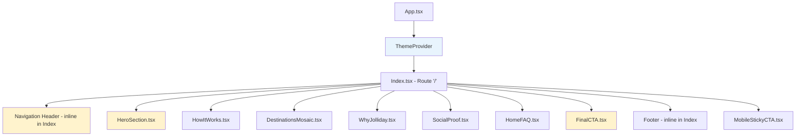

# Design Document: Homepage UI Redesign

## Overview

This design transforms the Jolliday homepage from a dark, heavy aesthetic (near-black backgrounds with electric violet accents) to a clean, light, professional design inspired by modern AI travel platforms. The redesign touches the CSS custom properties layer, the hero section component, the navigation header, all landing section components, and the ThemeProvider configuration — while preserving all existing functionality (routing, search, social proof, FAQ, CTA).

The approach is a **theme-layer-first** strategy: update the `:root` CSS variables in `index.css` to light values, then adjust individual components that use hardcoded dark-specific classes (e.g., `bg-black/50`, `text-white`, `bg-foreground`). This minimizes code churn because most components already reference design tokens via Tailwind utilities like `bg-background`, `text-foreground`, `border-border`.

### Key Design Decisions

1. **CSS Variables as single source of truth** — All color changes flow from `:root` variable updates. Components using token-based classes (`bg-background`, `text-foreground`) automatically inherit the new palette.
2. **Remove dark mode entirely** — Delete the `.dark` class CSS block, remove the ThemeToggle component, and set `defaultTheme="light"` with no toggle option. The site is light-only.
3. **Accent color shift** — Moving from electric violet (258° 90% 66%) to a more professional blue-violet in the 220–250° range with reduced saturation, ensuring WCAG AA compliance on white.
4. **No new dependencies** — All changes use existing Tailwind, CSS custom properties, and React component patterns.
5. **Component-level overrides** — Only components with hardcoded dark styles (HeroSection, FinalCTA, Index header, DestinationsMosaic overlay) need direct edits.

## Architecture

The homepage follows a straightforward component composition pattern:



**Yellow nodes** = components requiring direct style overrides (hardcoded dark classes).  
**Blue node** = configuration change (defaultTheme: "light").

### Change Layers

| Layer | Files Affected | Nature of Change |
|-------|---------------|-----------------|
| CSS Variables | `src/index.css` | Update `:root` HSL values to light palette, remove `.dark` block |
| Theme Config | `src/App.tsx` | Change `defaultTheme="dark"` → `"light"`, remove ThemeProvider or simplify |
| Hero Section | `src/components/HeroSection.tsx` | Remove photo bg + overlay, apply light gradient |
| Navigation | `src/pages/Index.tsx` (header block) | Add scroll-aware bg, fix contrast for light bg, remove ThemeToggle from footer |
| FinalCTA | `src/components/landing/FinalCTA.tsx` | Replace `bg-foreground` with light gradient |
| Destinations | `src/components/landing/DestinationsMosaic.tsx` | Reduce overlay from 70% to 50% opacity |
| MobileStickyCTA | `src/components/landing/MobileStickyCTA.tsx` | Already uses tokens — verify light appearance |
| ThemeToggle | `src/components/ThemeToggle.tsx` | Remove component entirely |

## Components and Interfaces

### 1. CSS Custom Properties (index.css `:root`)

The `:root` block is the foundation. New light-theme values:

```css
:root {
  --background: 0 0% 100%;          /* pure white */
  --foreground: 0 0% 7%;            /* near-black text */

  --card: 0 0% 99%;                 /* barely off-white */
  --card-foreground: 0 0% 7%;

  --popover: 0 0% 99%;
  --popover-foreground: 0 0% 7%;

  --primary: 234 62% 47%;           /* professional blue-violet, ~4.7:1 on white */
  --primary-foreground: 0 0% 100%;

  --secondary: 0 0% 96%;
  --secondary-foreground: 0 0% 7%;

  --muted: 0 0% 96%;
  --muted-foreground: 0 0% 35%;     /* body text gray */

  --accent: 234 62% 47%;
  --accent-foreground: 0 0% 100%;

  --destructive: 0 75% 50%;
  --destructive-foreground: 0 0% 100%;

  --border: 0 0% 90%;               /* light gray border */
  --input: 0 0% 90%;
  --ring: 234 62% 47%;

  --radius: 1rem;

  --font-sans: 'Inter', -apple-system, BlinkMacSystemFont, sans-serif;
  --font-display: 'Plus Jakarta Sans', 'Inter', sans-serif;
}
```

### 2. Dark Mode Removal

The `.dark` block in `index.css` is deleted entirely. The `ThemeToggle` component is removed from the footer in `Index.tsx` and the component file itself can be deleted. The `ThemeProvider` wrapper in `App.tsx` can either be removed (since there's no theme switching) or kept with `defaultTheme="light"` and `enableSystem={false}` for forward compatibility. The `darkMode: ["class"]` setting in `tailwind.config.ts` becomes inert but harmless to leave.

### 3. HeroSection Component

**Before:** Full-bleed Unsplash photo with `bg-black/50` overlay, white text.  
**After:** Solid light gradient background, dark text, white search bar with shadow.

```tsx
// Key structural changes:
// - Remove  and overlay div
// - Background: linear-gradient(180deg, hsl(0 0% 97%), hsl(0 0% 100%))
// - Headline: text-foreground (dark on light)
// - Subheadline: text-muted-foreground
// - Search bar: bg-white border border-border shadow-sm
// - Submit button: bg-primary text-primary-foreground
```

**Interface unchanged** — no props change, same navigation behavior on submit.

### 4. Navigation Header (Index.tsx)

**Before:** Always transparent, white text (relies on dark hero background for contrast).  
**After:** Scroll-aware — transparent at top, white/80 backdrop with border after 50px scroll.

```tsx
// New behavior:
// - useState for scrolled state
// - useEffect with scroll listener (threshold: 50px)
// - Conditional classes:
//   scrolled: "bg-white/80 backdrop-blur-md border-b border-border"
//   top: "bg-transparent"
// - Logo/text: text-foreground (always dark, works on both states)
// - CTA button: bg-primary text-primary-foreground
// - Sign in: text-foreground (text-only style)
```

### 5. FinalCTA Component

**Before:** `bg-foreground` (dark background) with `text-background` (white text).  
**After:** Light gradient background with dark text.

```tsx
// Background: bg-muted or linear-gradient with lightness ≥ 90%
// Headline: text-foreground
// Body: text-muted-foreground
// Button: bg-primary text-primary-foreground
```

### 6. DestinationsMosaic Overlay

**Before:** `from-black/70 via-black/20 to-transparent`  
**After:** `from-black/50 via-black/10 to-transparent`

Lighter overlay preserves photo visibility while maintaining text readability.

### 7. ThemeProvider Configuration (App.tsx)

```tsx
// Before:
<ThemeProvider attribute="class" defaultTheme="dark" enableSystem={false}>

// After (option A — remove entirely):
// No ThemeProvider wrapper, just render children directly

// After (option B — keep for forward compatibility):
<ThemeProvider attribute="class" defaultTheme="light" enableSystem={false} forcedTheme="light">
```

The `ThemeToggle` component is removed from the footer in `Index.tsx`. The `ThemeToggle.tsx` file is deleted.

## Data Models

No data model changes are required. This redesign is purely presentational — it modifies CSS variables, component class names, and one configuration string. All existing data flows (search query → `/chat?q=`, auth state, trip data) remain unchanged.

### Design Tokens (Conceptual Data Model)

| Token | Value (HSL) | Purpose |
|-------|------------|---------|
| `--background` | 0 0% 100% | Page background |
| `--foreground` | 0 0% 7% | Primary text |
| `--card` | 0 0% 99% | Card surfaces |
| `--muted` | 0 0% 96% | Muted backgrounds |
| `--muted-foreground` | 0 0% 35% | Secondary text |
| `--border` | 0 0% 90% | Borders |
| `--primary` | 234 62% 47% | Accent/CTA |
| `--accent` | 234 62% 47% | Focus/highlight |
| `--ring` | 234 62% 47% | Focus ring |

## Error Handling

This redesign is purely presentational and introduces no new error states or failure modes. Existing error handling remains unchanged:

| Scenario | Current Behavior | Impact of Redesign |
|----------|-----------------|-------------------|
| Empty search submission | Form prevents navigation (trim check) | None — logic unchanged |
| Auth state unavailable | Header shows sign-in link | None — conditional rendering unchanged |
| Image load failure (destinations) | Browser shows alt text | None — images unchanged |
| Theme toggle removed | Users could switch to dark mode | Dark mode no longer available — light only |
| Scroll listener error | Header stays transparent | New scroll listener uses same pattern as MobileStickyCTA |

### Graceful Degradation

- If CSS custom properties are unsupported (extremely old browsers), Tailwind's compiled classes provide fallback colors.
- If `backdrop-blur-md` is unsupported, the header background opacity (80%) still provides sufficient contrast.
- The `:root` variables define the light theme directly — no JavaScript theme initialization required for correct appearance.

## Testing Strategy

### Why Property-Based Testing Does Not Apply

This feature is a UI redesign involving CSS variable configuration, component styling changes, and visual layout modifications. PBT is not appropriate because:

- All acceptance criteria test **fixed configuration values** (specific HSL numbers), not behavior that varies with input
- The tests verify **rendered visual output** of components, not pure function logic
- Running 100 iterations would not find more bugs than a single assertion
- There are no universal properties that hold across a wide input space

### Recommended Testing Approach

#### 1. Unit Tests (Vitest + Testing Library)

Verify specific CSS values, component rendering, and preserved functionality:

- **Theme configuration**: Verify ThemeProvider uses `forcedTheme="light"` or is removed entirely
- **Dark mode removed**: Verify no `.dark` class block exists in CSS, ThemeToggle component is gone
- **CSS variable validation**: Parse `:root` variables and assert HSL values meet requirements (lightness, saturation, hue ranges)
- **Contrast ratio checks**: Compute WCAG contrast ratios between foreground/background pairs and assert minimums (4.5:1, 7:1)
- **Component rendering**: Verify HeroSection renders without `bg-black/50` overlay, FinalCTA uses light background
- **Search functionality**: Verify form submission navigates to `/chat?q=<encoded>`
- **DOM order**: Verify section components render in correct order
- **Scroll behavior**: Verify header background changes after scroll threshold

#### 2. Visual Regression Tests (Manual / Snapshot)

- Screenshot comparison at each breakpoint (320px, 640px, 768px, 1024px, 1200px)
- Verify no horizontal overflow at any breakpoint
- Verify MobileStickyCTA appearance on mobile after scroll
- Verify card styling (shadow, border-radius, border color)

#### 3. Build Verification (CI)

- `npm run build` exits with code 0
- No TypeScript errors
- No ESLint errors
- Console error-free rendering (can be automated with Playwright or Cypress)

#### 4. Accessibility Verification

- WCAG AA contrast ratios verified programmatically for all text/background pairs
- Tap target sizes verified at 320px viewport
- Focus states visible with new accent color

### Test File Structure

```
src/__tests__/
  homepage-redesign/
    theme-variables.test.ts      — CSS variable value assertions
    contrast-ratios.test.ts      — WCAG contrast calculations
    hero-section.test.tsx        — HeroSection rendering
    navigation-header.test.tsx   — Scroll-aware header behavior
    section-order.test.tsx       — DOM order verification
    search-functionality.test.tsx — Search form navigation
```

### Key Test Examples

```typescript
// theme-variables.test.ts
describe('Light theme CSS variables', () => {
  it('--background has lightness >= 98%', () => {
    // Parse HSL from computed style
    // Assert lightness >= 98
  });

  it('--foreground has lightness <= 10%', () => {
    // Parse HSL from computed style
    // Assert lightness <= 10
  });

  it('foreground/background contrast ratio >= 4.5:1', () => {
    // Convert HSL to relative luminance
    // Compute WCAG contrast ratio
    // Assert >= 4.5
  });
});

// hero-section.test.tsx
describe('HeroSection', () => {
  it('does not render a dark overlay element', () => {
    render(<HeroSection />);
    // Assert no element with bg-black/50 class exists
  });

  it('navigates to /chat?q= on form submit', () => {
    render(<HeroSection />, { wrapper: MemoryRouter });
    // Type in input, submit form
    // Assert navigation called with correct URL
  });
});
```

